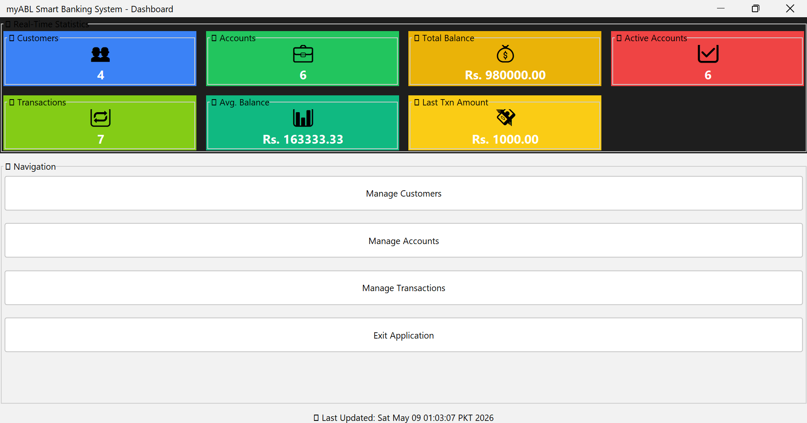
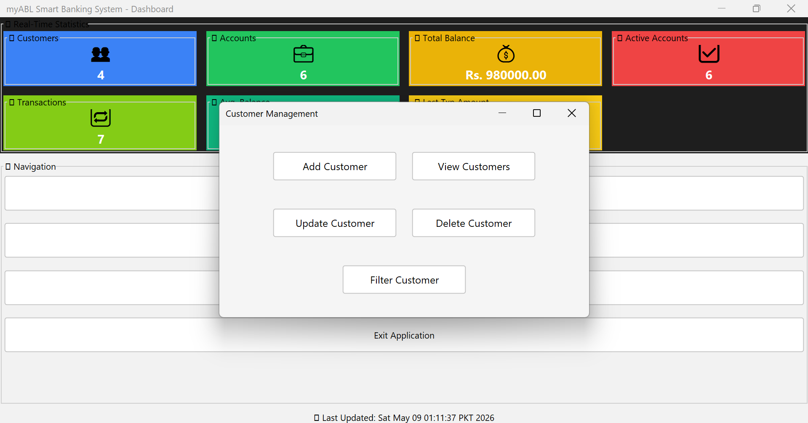
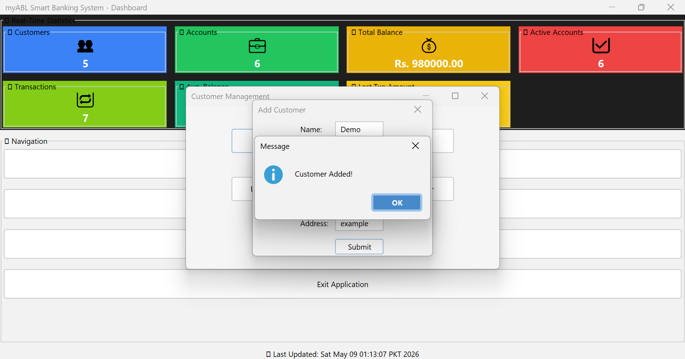
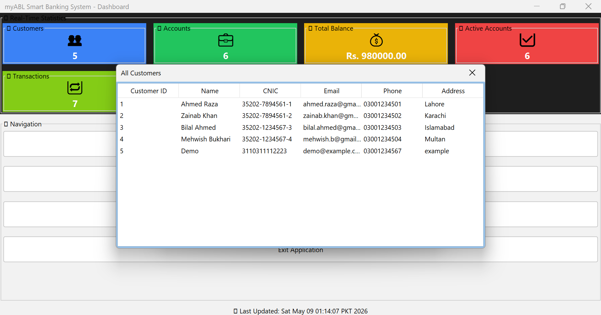
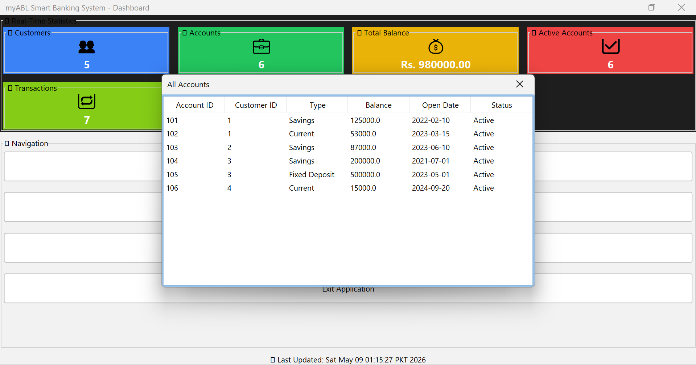
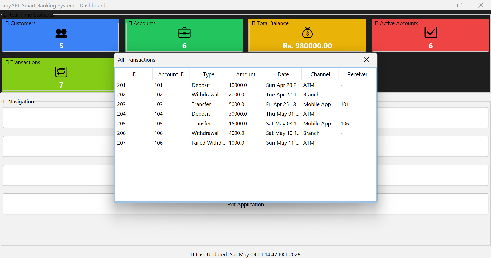
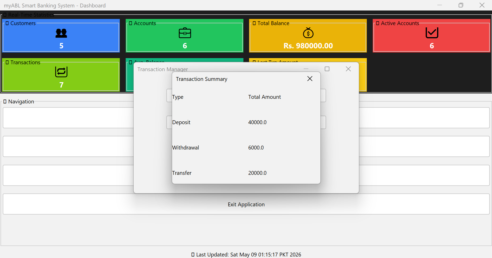
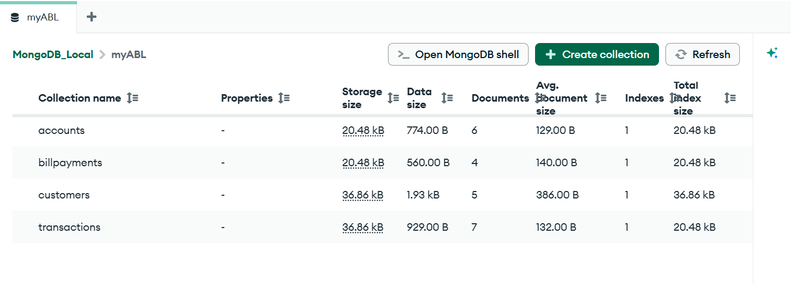

# 💼 myABL MongoDB Java Banking System

A Java Swing-based banking management system integrated with MongoDB, designed for performing CRUD operations on customers, accounts, transactions, and bill payments.  
This project was developed for the **Database Systems** course in the **3rd Semester**, with the main focus on converting a relational SQL-based banking database into a NoSQL MongoDB architecture while maintaining proper database structure and functionality.

---

# ✨ Features

- 👤 Customer Management
  - Add Customers
  - View Customers
  - Update Customers
  - Delete Customers
  - Filter/Search Customers

- 🏦 Account Management
  - Create and Manage Accounts
  - View Account Information
  - Account Status Tracking

- 💸 Transaction Management
  - Deposit
  - Withdrawal
  - Transfer
  - Transaction History
  - Transaction Summary

- 📊 Real-Time Dashboard Statistics
  - Total Customers
  - Active Accounts
  - Total Balance
  - Average Balance
  - Total Transactions

- 🍃 MongoDB NoSQL Database Integration

- 🎨 Modern Java Swing GUI using FlatLaf

---

# 🖼️ Project Screenshots

---

## 📌 Dashboard Overview



---

## 👥 Customer Management Menu



---

## ➕ Add Customer Operation



---

## 🔍 Filter Customers


---

## 📋 View Customers



---

## 🏦 View Accounts



---

## 💳 View Transactions



---

## 📈 Transaction Summary



---

## 🍃 MongoDB Collections



---

## 🚀 How to Run the Project

You have **three options** to run the application:

---

### ✅ Option 1: Run Like a Desktop App (Recommended)

1. Navigate to the `target` folder in this directory.
2. Find the file named: `myABL.vbs`
3. **Double-click** `myABL.vbs` to launch the application.

> This method runs the app silently — no command prompt appears.

---

### 🖥 Option 2: Run via Command Prompt (Console)

1. Open Command Prompt (`Win + R`, type `cmd`, press Enter)
2. Navigate to the project’s `target` folder:
   ```bash
   cd "target"
   ```
3. Run the shaded JAR file:
   ```bash
   java -jar mongoproject-fat.jar
   ```

---

### ⚙️ Option 3: Run Using Maven

> This method is useful during development.

1. Make sure you're in the root project directory (where `pom.xml` is).
2. Run the following command:
   ```bash
   mvn compile exec:java
   ```
> This uses the `exec-maven-plugin` defined in your `pom.xml` to launch the `demo.App` class.

---

## 📦 Project Build Info

- Built using: **Java 17**, **MongoDB Java Driver**, **FlatLaf**, **Gson**
- GUI: **Java Swing**
- Database: **MongoDB** (default local instance on `localhost:27017`)

---

## 🔧 Requirements

- **Java 17+** must be installed and added to PATH.
- **MongoDB** must be installed and running locally.
- **Maven** is required if using Option 3.

---

## 📁 Folder Structure

```
mongoproject/
│
├── pom.xml
├── src/
├── target/
│   ├── mongoproject-fat.jar
│   └── myABL.vbs ✅ (Double-click this)
├── NOTE.md 🟡 (You are here)
```

---

## 💡 Tip

You can create a **shortcut of `myABL.vbs` on your Desktop** for quick access like a real app.

---

Enjoy your banking system app! 🏦✨
