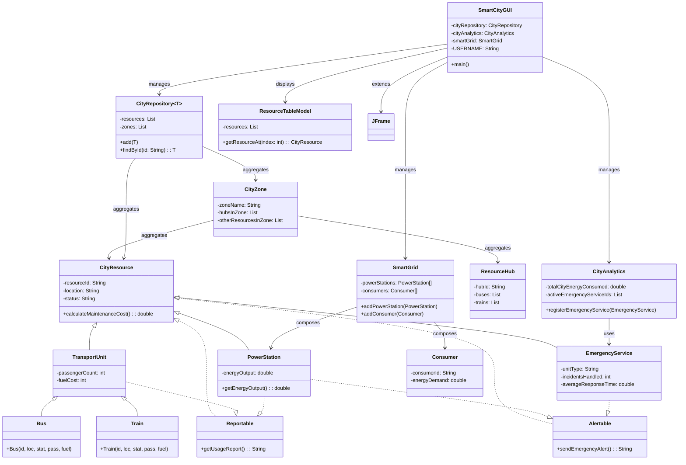

```mermaid
classDiagram
    %% Interfaces
    class Alertable {
        +sendEmergencyAlert(): String
    }
    class Reportable {
        +getUsageReport(): String
    }

    %% Abstract Classes
    class CityResource {
        -resourceId: String
        -location: String
        -status: String
        +calculateMaintenanceCost(): double
    }

    %% Concrete Resources
    class PowerStation {
        -energyOutput: double
        +getEnergyOutput(): double
    }

    class EmergencyService {
        -unitType: String
        -incidentsHandled: int
        -averageResponseTime: double
    }

    class TransportUnit {
        -passengerCount: int
        -fuelCost: int
    }

    class Bus {
        +Bus(id, loc, stat, pass, fuel)
    }

    class Train {
        +Train(id, loc, stat, pass, fuel)
    }

    %% Additional Classes
    class Consumer {
        -consumerId: String
        -energyDemand: double
    }

    class SmartGrid {
        -powerStations: PowerStation[]
        -consumers: Consumer[]
        +addPowerStation(PowerStation)
        +addConsumer(Consumer)
    }

    class ResourceHub {
        -hubId: String
        -buses: List<Bus>
        -trains: List<Train>
    }

    class CityZone {
        -zoneName: String
        -hubsInZone: List<ResourceHub>
        -otherResourcesInZone: List<CityResource>
    }

    class CityAnalytics {
        -totalCityEnergyConsumed: double
        -activeEmergencyServiceIds: List<String>
        +registerEmergencyService(EmergencyService)
    }

    class CityRepository~T~ {
        -resources: List<T>
        -zones: List<CityZone>
        +add(T)
        +findById(id: String): T
    }

    class SmartCityGUI {
        -cityRepository: CityRepository
        -cityAnalytics: CityAnalytics
        -smartGrid: SmartGrid
        -USERNAME: String
        +main()
    }

    class ResourceTableModel {
        -resources: List<CityResource>
        +getResourceAt(index: int): CityResource
    }

    class JFrame

    %% Relationships
    CityResource <|-- TransportUnit
    CityResource <|-- PowerStation
    CityResource <|-- EmergencyService
    TransportUnit <|-- Bus
    TransportUnit <|-- Train

    CityResource <|.. Alertable
    CityResource <|.. Reportable

    PowerStation ..|> Alertable
    EmergencyService ..|> Alertable
    TransportUnit ..|> Reportable
    PowerStation ..|> Reportable

    SmartGrid --> PowerStation : composes
    SmartGrid --> Consumer : composes
    CityZone --> ResourceHub : aggregates
    CityZone --> CityResource : aggregates
    CityRepository --> CityZone : aggregates
    CityRepository --> CityResource : aggregates
    CityAnalytics --> EmergencyService : uses
    SmartCityGUI --> CityRepository : manages
    SmartCityGUI --> CityAnalytics : manages
    SmartCityGUI --> SmartGrid : manages
    SmartCityGUI --> JFrame : extends
    SmartCityGUI --> ResourceTableModel : displays
```
