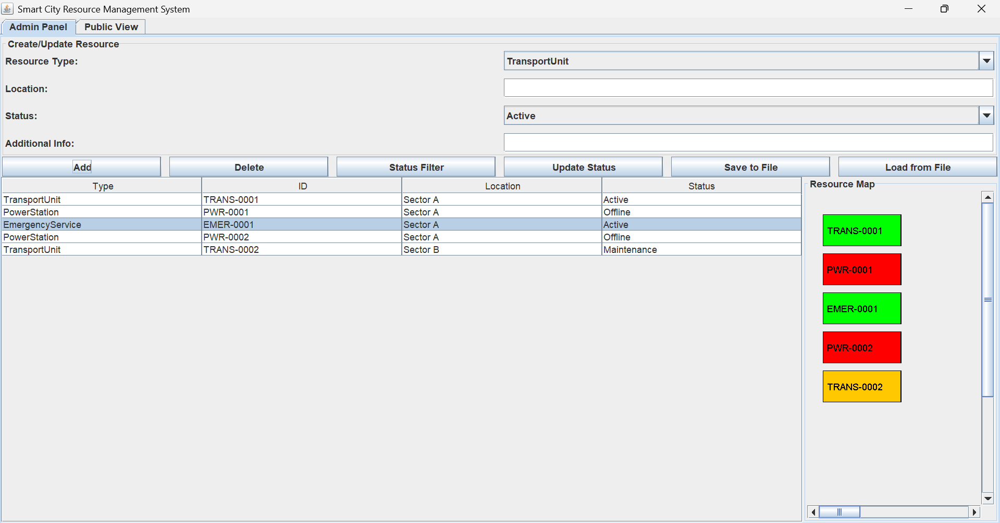
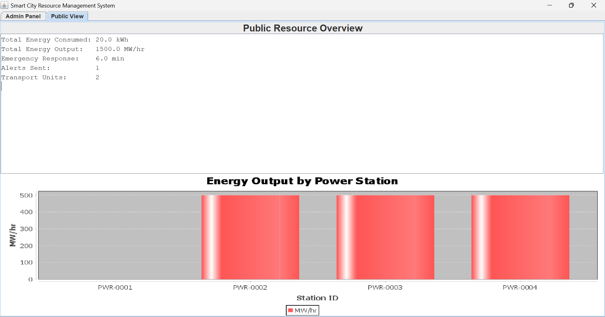
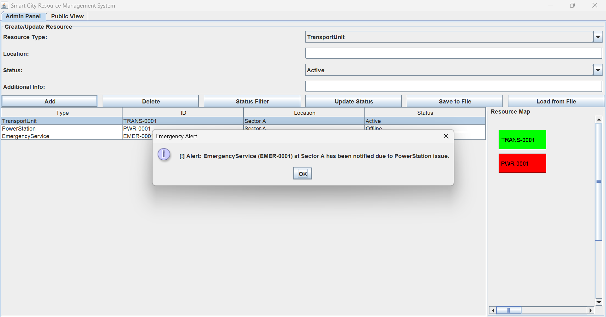
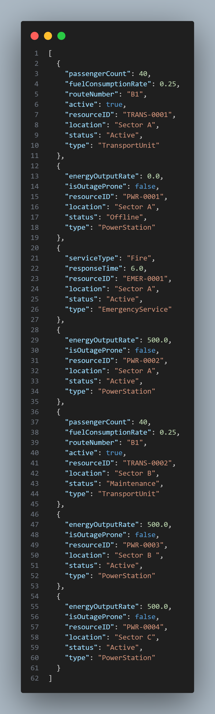
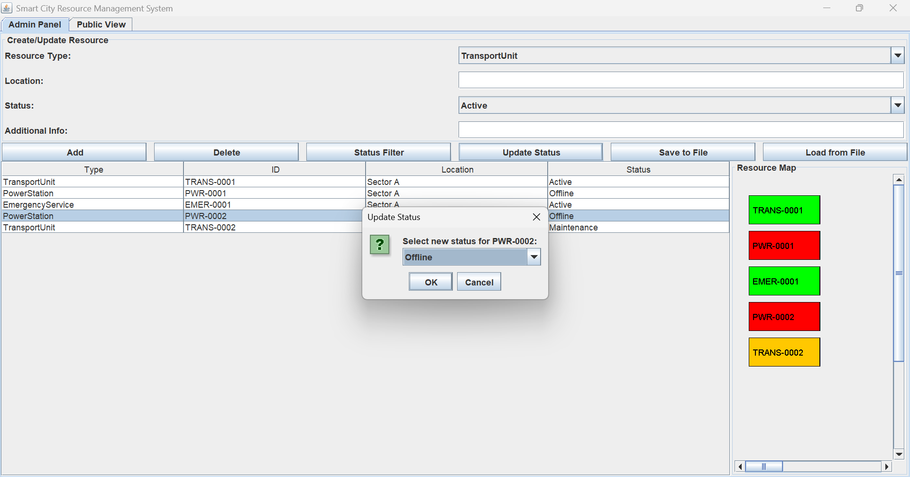

# Smart City Resource Management System

<p align="center">
  
  
  
  
</p>

---

## 📌 Overview

The **Smart City Resource Management System** is a Java Swing based desktop application designed to simulate and manage critical urban infrastructure resources such as transportation units, power stations, and emergency response services within a smart city environment.

The project demonstrates advanced **Object-Oriented Programming (OOP)** concepts including abstraction, inheritance, polymorphism, interfaces, composition, aggregation, generics, exception handling, and multithreading through a fully interactive graphical user interface.

The system enables administrators to manage city resources dynamically while also providing a public analytics dashboard displaying real-time city metrics and energy usage trends.

---

# ✨ Key Features

- ✅ Java Swing based graphical user interface
- ✅ CRUD operations for smart city resources
- ✅ Real-time resource status visualization
- ✅ Color-coded smart city resource map
- ✅ Emergency alert dependency system
- ✅ Public analytics dashboard
- ✅ Dynamic status updates
- ✅ JSON-based data persistence using GSON
- ✅ Runtime polymorphic serialization/deserialization
- ✅ Generics-based repository implementation
- ✅ City-wide metrics tracking
- ✅ JFreeChart integration for analytics
- ✅ Resource filtering & monitoring
- ✅ Modular OOP architecture

---

# 🧠 OOP Concepts Implemented

| Concept | Implementation |
|---|---|
| Abstraction | `CityResource` abstract class |
| Inheritance | `TransportUnit`, `PowerStation`, `EmergencyService` |
| Polymorphism | Overridden `toString()` and `calculateMaintenanceCost()` |
| Interfaces | `Alertable`, `Reportable` |
| Composition | `CityZone` contains `ResourceHub` |
| Aggregation | `SmartGrid` manages power stations & consumers |
| Generics | `CityRepository<T>` |
| Exception Handling | File handling & corrupted JSON protection |
| Multithreading | Dynamic transport scheduling simulation |
| File Handling | JSON save/load using GSON |

---

# 📸 Project Demonstration

## 🖥️ Admin Resource Management Panel



---

## 📊 Public Analytics Dashboard



---

## 🚨 Emergency Alert & Dependency System



---

## 💾 JSON-Based Data Persistence



---

## 🔄 Dynamic Resource Status Updates



---

# 🏗️ System Architecture

The application follows a modular architecture with clear separation of responsibilities:

- GUI Layer → Handles user interaction and visualization
- Models Layer → Represents smart city resources
- Repository Layer → Generic data management
- Utility Layer → Metrics, alerts, serialization, ID generation
- Zones Layer → Smart grid & city zone management

---

# 📂 Project Structure

```text
SmartCityProject-OOP-
├── Documentation
├── images
├── lib
├── src
│   ├── gui
│   ├── interfaces
│   ├── models
│   ├── repository
│   ├── utils
│   └── zones
├── bin
├── resources.json
├── run.bat
├── run.sh
└── README.md
```

---

# ⚙️ Technologies Used

- Java
- Java Swing
- Object-Oriented Programming (OOP)
- GSON
- JSON
- JFreeChart
- Java Collections Framework
- File Handling
- Multithreading
- Exception Handling

---

# 🚀 How to Run

## Windows

```bash
run.bat
```

Or manually:

```bash
javac -cp "lib\*" -d bin src/**/*.java
java -cp "bin;lib/*" Main
```

---

## Linux / macOS

```bash
chmod +x run.sh
./run.sh
```

Or manually:

```bash
javac -cp "lib/*" -d bin src/**/*.java
java -cp "bin:lib/*" Main
```

---

# 📈 Core Functionalities

## 🔹 Resource Management
- Add, update, delete, and filter smart city resources.

## 🔹 Smart Resource Mapping
- Visual representation of resources using color-coded status indicators:
  - 🟢 Active
  - 🔴 Offline
  - 🟡 Maintenance

## 🔹 Emergency Dependency System
- Offline or outage-prone power stations automatically trigger emergency alerts.

## 🔹 Public Monitoring Dashboard
- Displays:
  - Energy consumption
  - Energy output
  - Alerts sent
  - Emergency response metrics
  - Transport statistics

## 🔹 Persistent Data Storage
- Save and load city resources using JSON serialization.

---

# 📚 Libraries Used

| Library | Purpose |
|---|---|
| GSON | JSON serialization/deserialization |
| JFreeChart | Dashboard analytics visualization |

---

# 👨‍💻 Academic Context

This project was developed as part of an Object-Oriented Programming course to demonstrate real-world application development using Java and Java Swing while implementing advanced software engineering and OOP principles.

---

# ⭐ Highlights

- Desktop GUI Application
- Advanced OOP Architecture
- Interactive Data Visualization
- Smart City Simulation
- Real-Time Monitoring
- Modular Design
- JSON Persistence
- Event-Driven Programming

---

# 📄 License

This project is developed for educational and academic purposes.
