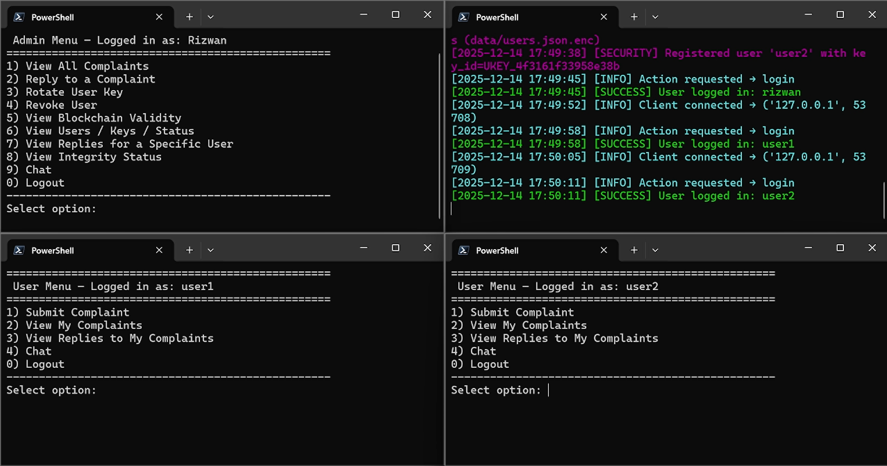
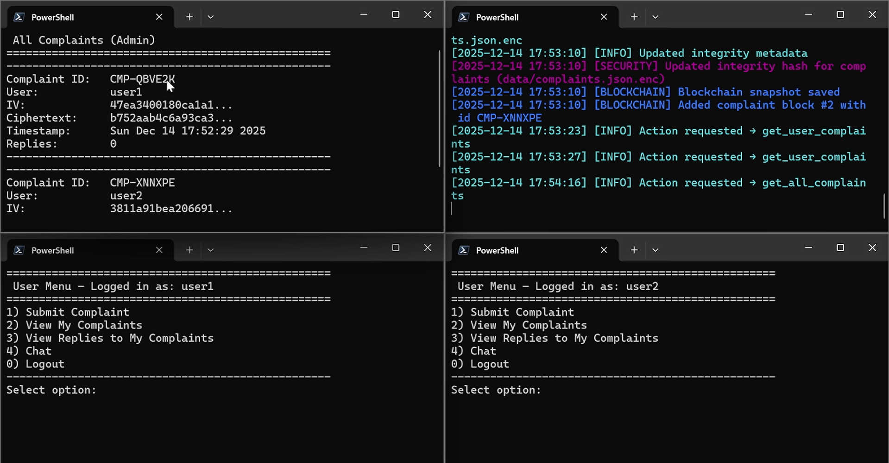
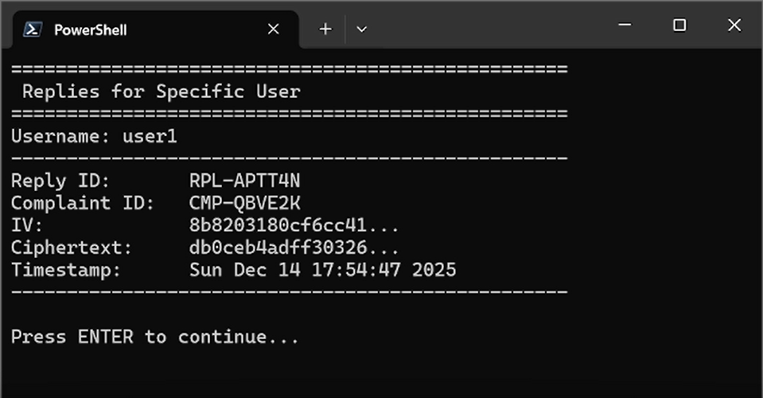
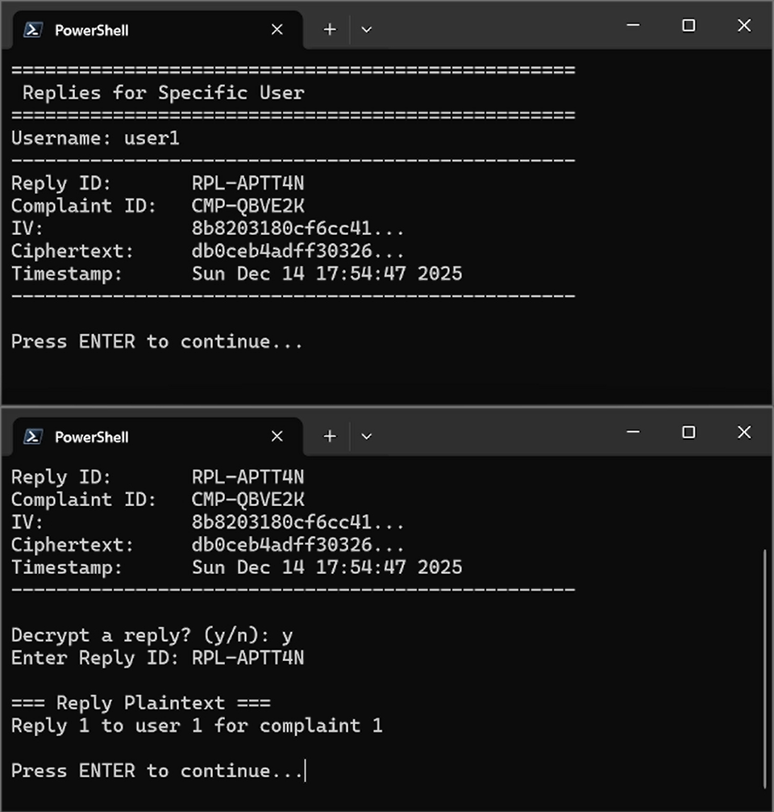
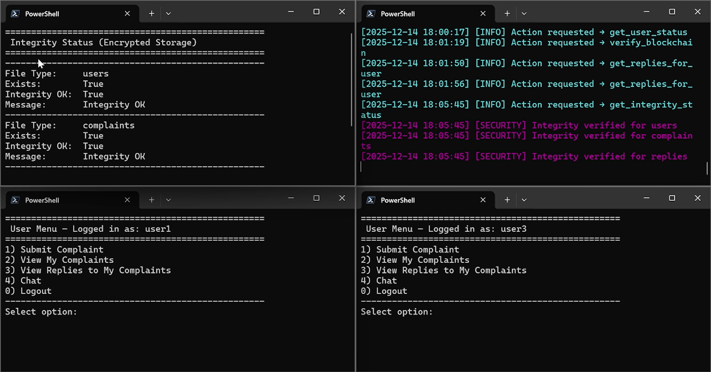
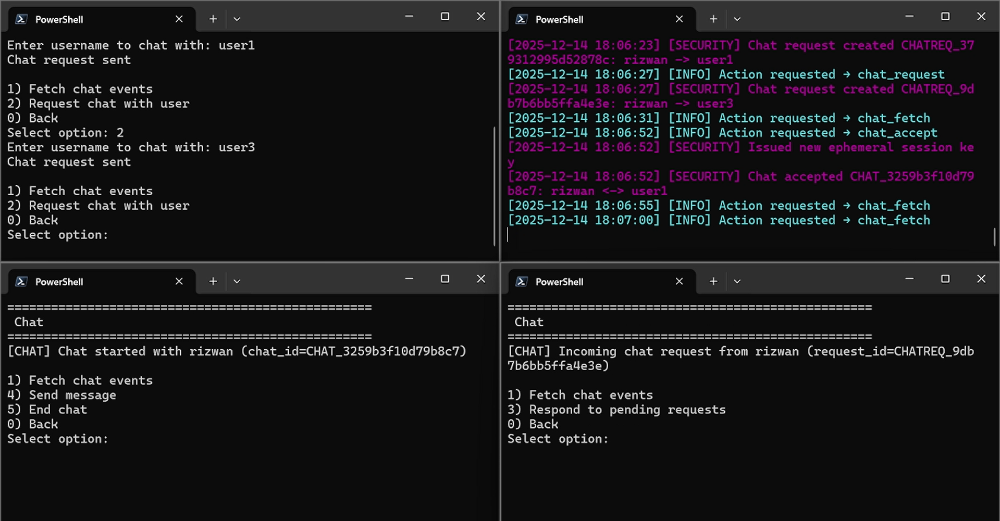
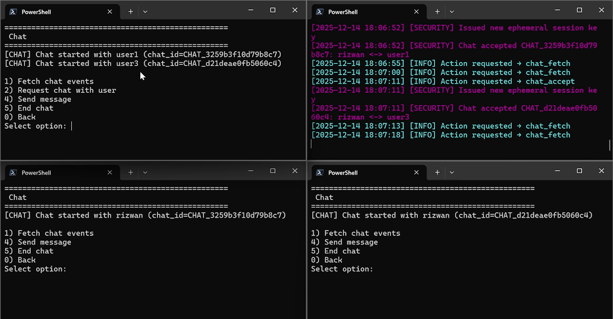

# Secure Complaint Management System

A Python-based **Secure Complaint Management System** developed as a course project for **Information Security**.  
This project demonstrates how cryptographic techniques, secure communication, encrypted storage, blockchain-based integrity, and client-server networking can be combined in one working system.

---

# Project Overview

The system allows users to submit complaints securely, while administrators can view, reply, verify integrity, manage users, rotate keys, revoke users, and communicate through encrypted chat sessions.

The project was built to practically implement core Information Security concepts rather than only studying them theoretically.

---

# Key Features

- Secure user and admin authentication
- AES-256-CBC encryption with PKCS#7 padding
- SHA-256 hashing for integrity verification
- KDC-inspired session key generation
- Ephemeral Diffie-Hellman key exchange demonstration
- Encrypted complaint submission
- Encrypted admin replies
- Blockchain-based complaint and reply validation
- Secure encrypted live chat between admin and users
- User key rotation
- User revocation
- Encrypted persistent storage
- Integrity checking for encrypted files
- Multi-client socket-based communication
- Server-side security logging

---

# Technologies Used

- Python
- Socket Programming
- AES-CBC Encryption
- SHA-256 Hashing
- PKCS#7 Padding
- Diffie-Hellman Key Exchange
- Blockchain / Proof-of-Work
- JSON-based Encrypted Storage
- Multi-threaded Server Architecture

---

# Project Structure

```text
secure_complaint_system/
│
├── server/
│   ├── server.py
│   ├── key_manager.py
│   ├── complaint_manager.py
│   ├── storage.py
│   ├── logger.py
│
├── client/
│   ├── client.py
│   ├── ui.py
│   ├── crypto_client.py
│
├── crypto/
│   ├── crypto_utils.py
│   ├── session_keys.py
│
├── blockchain/
│   ├── blockchain.py
│
├── data/
│   ├── users.json.enc
│   ├── complaints.json.enc
│   ├── replies.json.enc
│   ├── blockchain.json
│   └── logs/
│
├── run_server.py
├── run_client.py
└── README.md
```

---

# How to Run

## 1. Clone the Repository

```bash
git clone https://github.com/rizwanshafiq63/CS-Semester-Projects.git
```

---

## 2. Navigate to the Project Folder

```bash
cd CS-Semester-Projects/4th-semester/Information_Security/Lab_Finals_Project
```

---

## 3. Install Required Dependencies

```bash
pip install pycryptodome
```

---

## 4. Start the Server

```bash
python run_server.py
```

---

## 5. Start the Client

Open another terminal and run:

```bash
python run_client.py
```

For testing multiple users, open multiple client terminals.

---

# System Demonstration

## Admin Dashboard and Multi-Client Login

The system supports multiple connected users with server-side activity logs.



---

## Encrypted Complaint Management

Admins can view encrypted complaints. Complaints are stored with IV, ciphertext, timestamp, and complaint ID.



---

## Encrypted Replies

Admin replies are encrypted before storage and can be viewed by authorized users only.



---

## Reply Decryption by Authorized User

Users can decrypt only the replies related to their own complaints.



---

## Integrity Verification of Encrypted Storage

The system verifies encrypted storage files such as users, complaints, and replies using integrity hashes.



---

## Secure Chat Request Flow

The admin can request encrypted chat sessions with users. The server logs chat requests, approvals, and session key issuance.



---

## Encrypted Live Chat Sessions

The system supports secure live chat sessions between admin and users with session-based encryption.



---

# Security Concepts Implemented

## AES-CBC Encryption

Sensitive data such as complaints, replies, and storage records are encrypted using AES-CBC mode with PKCS#7 padding.

---

## Session Key Management

The system includes KDC-inspired session key generation for secure communication.

---

## Diffie-Hellman Key Exchange

An Ephemeral Diffie-Hellman mechanism is implemented as a demonstration of secure shared key generation.

---

## SHA-256 Integrity Verification

Encrypted files are checked using SHA-256 hashes to detect tampering.

---

## Blockchain-Based Validation

Complaints and replies are added to a blockchain structure using proof-of-work, nonce, block hashes, and previous hash linking.

---

## User Revocation and Key Rotation

Admins can revoke users and rotate user keys to demonstrate key lifecycle management.

---

# Learning Outcomes

This project strengthened my understanding of:

- Applied cryptography
- Secure system design
- Client-server communication
- Secure storage
- Blockchain integrity
- Key management
- Encrypted messaging
- Authentication and authorization
- Information Security implementation in Python

---

# Repository Links

## Course Repository

https://github.com/CS-CUI/finaltermproject-muhammad_rizwan_shafiq

---

## Personal Repository

https://github.com/rizwanshafiq63/CS-Semester-Projects/tree/main/4th-semester/Information_Security/Lab_Finals_Project

---

# Author

**Muhammad Rizwan Shafiq**

---

# Disclaimer

This project was developed for academic and learning purposes as part of an Information Security course. It demonstrates security concepts in a controlled educational environment.
